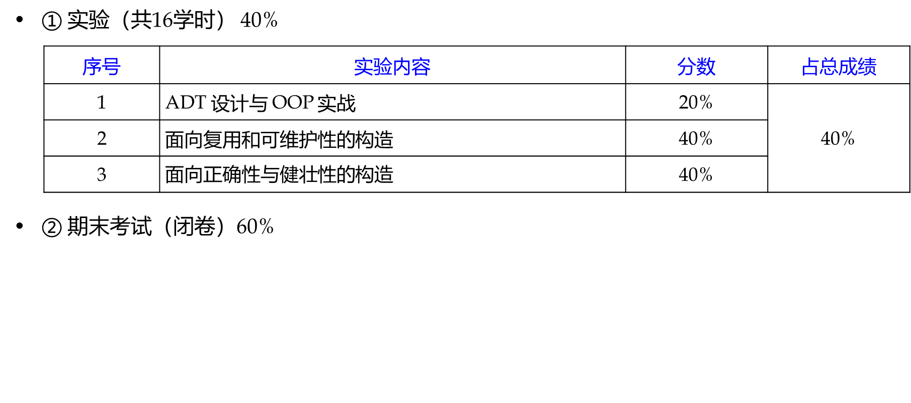

## 参考资料
[MIT Course 6.031: Software Construction(fa21)](http://web.mit.edu/6.031/www/fa21)
	[本部18春-李秋豪翻译版](https://www.cnblogs.com/liqiuhao/category/1167752.html)
[CMU 17-214    Principles of Software Construction: Objects, Design, and Concurrency(2021-spring)](https://www.cs.cmu.edu/~charlie/courses/17-214/2021-spring)

## 课程安排
下面的章节应该是对应本部往年课件
① 软件构造基础 (4学时)
第1,2章

② ADT+OOP (14学时)
第3-7章，习题课1，实验一 6学时

③ 可复用性和可维护的软件构造 (8学时)
 第8-10讲，习题课2，实验二，6学时

④ 面向健壮性与正确性的软件构造 (6学时)
第11章，习题课3，实验三 4学时

## 考试题型（原定）
### 客观题（30）
单选或判断
15✖️2
### 主观题（70）
读程序，程序改错，简答，设计

给出需求、ADT 的基本代码，开展设计：绘图/建模、设计、修改代码、写新代码（不强调语法）、写注释（AF/RI/Spec/Testing Strategy/Safety from Rep Exposure）、设计测试用例、改进/优化各项质量指标等

程序改错，简答 2✖️10
设计题，2✖️10
综合体，2✖️15

## 考试题型（实际）
30 判断 15✖️2
20 改错 10✖️2，第十章自定义exception
10 快照图，ppt 原题
25 ADT，20 年本部原题
15 OOP，类图 5、类的代码 6、客户端代码 4，PPT 适配器模式

这份卷子对知识的覆盖度是不够的，分值也不太合理，个人认为没有参考价值
第一、第二章只各出了一道很简单的判断
第三章考了快照图
第四章考了 spec 中前置条件的强弱比较，没有考写规约
第五章 AF, RI, and safety from rep exposure 均没考
第八章只考了一种模式的写法，不涉及比较
第九章没考
第十章考了异常处理
