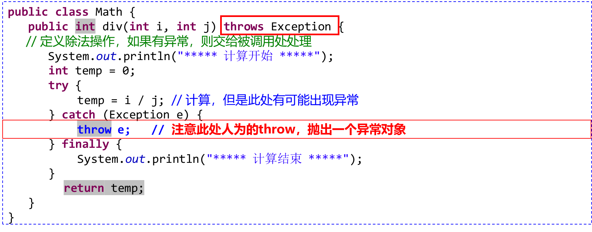
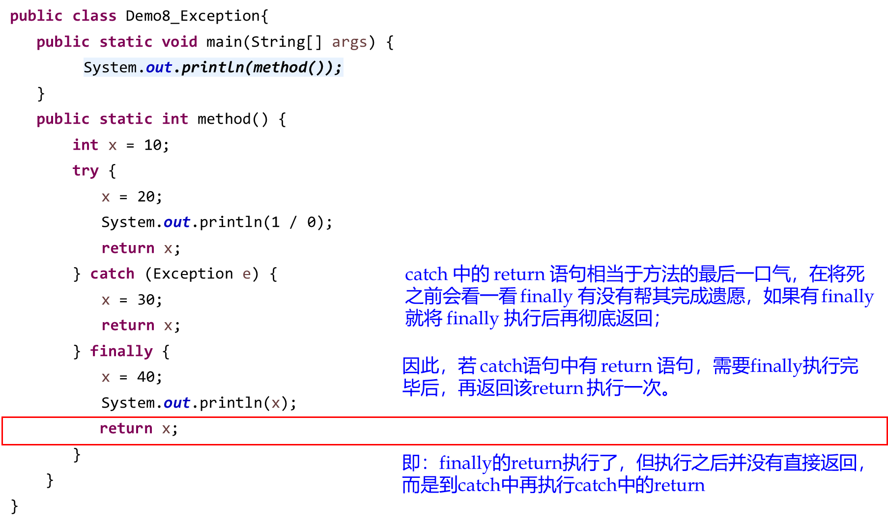

# 正确性与健壮性
## 健壮性
系统在不正常输入或不正常外部环境下仍能够表现正常的程度
### Robust programming 面向健壮性的编程
处理未期望的行为和错误终止
即使终止执行，也要准确/无歧义的向用户展示全面的错误信息
错误信息有助于进行debug

### Robustness principle ：Postel’s Law 伯斯塔尔法则
程序员应总是假定用户恶意、假定自己的代码可能失败
把用户想象成白痴，可能输入任何东西
发送的内容要保守，接受的内容要自由

## 正确性
程序按照 spec 加以执行的能力，是最重要的质量指标！

### Robustness vs. correctness: at opposite ends of the scale. 
正确性：永不给用户错误的结果
健壮性：尽可能保持软件运行而不是总是退出
正确性倾向于直接报错(error)，健壮性则倾向于容错(fault-tolerance)

#### 举例


## 健壮性和正确性的度量
•外部观察角度
	平均故障间隔时间（平均无故障运行时间），是指相邻两次故障之间的平均工作时间。
•内部观察角度（间接）
	[残留缺陷率](9.软件测试与测试优先的编程.md#残留缺陷率)
# 异常处理
Exceptions are derived from Throwable

## 分类
运行时异常：由程序员在代码里处理不当造成
其他异常：由外部原因造成

### 异常处理机制的角度

#### Unchecked exception:
1.Errors and Runtime Exceptions are not checked by compiler
2.不需要在编译的时候用try…catch等机制处理
3.可以不处理，编译没问题，但执行时出现就导致程序失败，代表程序中的潜在 bug

•Unchecked 异常代表存在 bug(代码实现中或者client调用中)，不用声明
#### Checked exception:
1.编译器可帮助检查你的程序是否已抛出或处理了可能的异常
2.必须捕获并进行错误处理，否则编译无法通过
3.类似于编程语言中的 static type checking

•程序员必须在方法的 spec 中明确写清本方法会抛出的所有 checked exception，以便于调用该方法的 client 加以处理

## 异常中的子类型多态
如果子类型中 override 了父类型中的函数，那么子类型中方法抛出的异常不能比父类型抛出的异常类型更宽泛
子类型方法可以抛出更具体的异常，也可以不抛出任何异常
如果父类型的方法未抛出异常，那么子类型的方法也不能抛出异常。
参见LSP原则
	目标是子类型多态：客户端可用统一的方式处理不同类型的对象，子类型可替代父类型

## 创建 Exception 类
•如果 JDK 提供的 exception类 无法充分描述你的程序发生的错误，可以创建自己的异常类, 从 Exception 类继承
可能引发或传播此异常的方法必须声明它

## 是否需要处理异常
•如果一个方法可以引发异常，它本身对异常进行了处理（try…catch…finally），那么调用者不必处理该方法产生的异常。

•如果一个方法可以引发异常，而它本身并没有对该异常进行处理，那么该方法必须将这个异常抛给调用者可以使程序能够继续执行下去，这时候就要用到throws 语句

throws关键字除了在普通的方法上使用之外，还可以在主方法上。如果在主方法上就表示一旦出现了异常之后，继续向上抛，由JVM进行处理。


## throw和 throws
•throw关键字是 在程序中 人为的 抛出一个异常对象。
•可以发现：throw直接抛出异常类的实例化对象。
•一般情况下，用户都在避免异常的产生，所以不会手工抛出一个新的异常，而往往会抛出程序中已经产生的异常实例。
•所以，throw一般和throws联合使用
示例：


## try...catch方式异常处理讨论
```Java
try{     //检测异常
  可能出现异常的语句；   
} catch (异常类型1 异常对象){   //捕获异常类型1
  处理异常语句 ；
} catch (异常类型2 异常对象){   //捕获异常类型2
  处理异常语句 ；
} ...
finally {   //释放资源
  异常处理的统一出口，释放资源相关语句 ;
}
```




