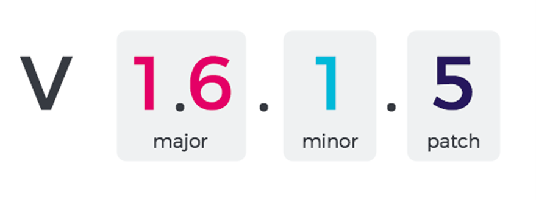
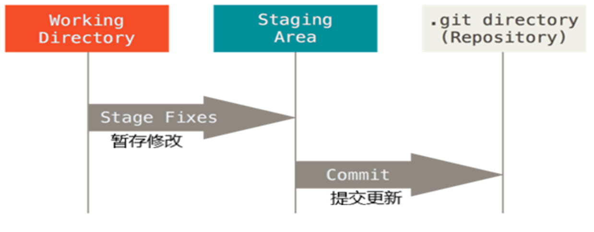
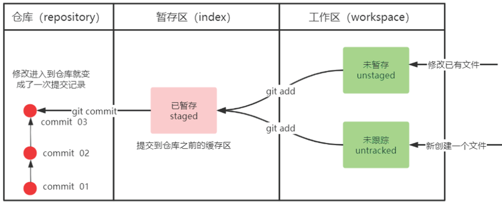
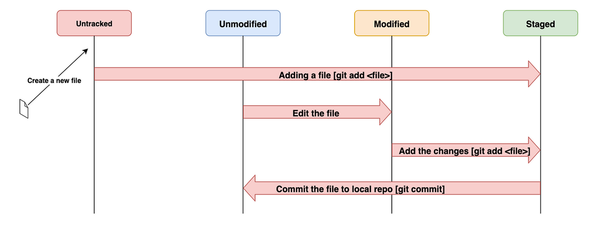
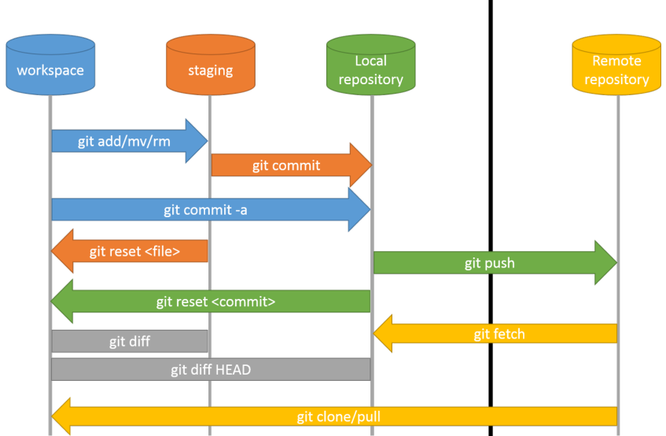
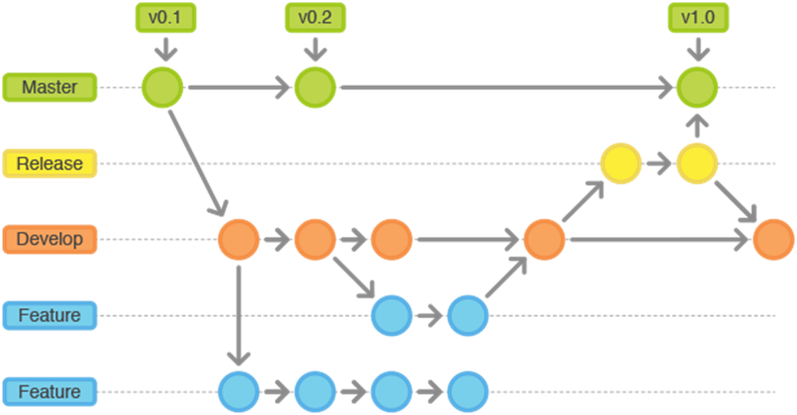
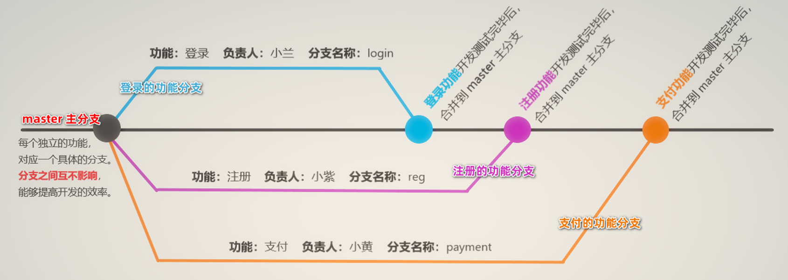

# 软件配置管理 (SCM) 
软件配置管理：追踪和控制软件的变化。
软件配置项：软件中发生变化的基本单元（例如：文件）
基线：软件持续变化过程中的“稳定时刻”（例如：对外发布的版本）

# Git 介绍
 版本控制系统 (VCS)


## 特点1 ：直接记录快照，而非差异比较
Git 快照是在原有文件版本的基础上重新生成一份新的文件，类似于备份。
为了效率，如果文件没有修改，Git 不再重新存储该文件，而是只保留一个链接指向之前存储的文件。

优点：
	版本切换时非常快，因为每个版本都是完整的文件快照，切换版本时直接恢复目标版本的快照即可。
缺点：
	占用磁盘空间较大
## 特点2：近乎所有操作都是本地执行
## Git 中的三个区域
工作区（working directory）
	处理工作的区域
	local file system
暂存区（staging area）
	已完成的工作的临时存放区域，等待被提交
	in memory
Git 仓库（repository）
	本地最终的存放区域
	.git directory (a repository storing all version control data)
## Git 中的四种状态

未修改（Unmodified）
	工作区中文件的内容和 Git 仓库中文件的内容保持一致

已修改 Modified
	表示修改了文件，但还没将修改的结果放到暂存区

已暂存 Staged
	表示对已修改文件的当前版本做了标记，使之包含在下次提交的列表中

已提交 Committed
	表示文件已经安全地保存在本地的 Git 仓库中

•工作区的文件被修改了，但还没有放到暂存区，就是已修改状态。
•如果文件已修改并放入暂存区，就属于已暂存状态。
•如果 Git 仓库中保存着特定版本的文件，就属于已提交状态。
Git 操作的终极结果：让工作区中的文件都处于“未修改”的状态。
## Git 工作的基本流程

基本的 Git 工作流程如下：
①在工作区中修改文件
②将想要下次提交的更改进行暂存
③提交更新，找到暂存区的文件，将快照永久性存储到 Git 仓库

git add  (工作区 --> 暂存区)；git commit (暂存区 --> 本地仓库)；git status（查看文件状态，-s 简化方式）


# Git 基本操作

## ① 获取 Git 仓库
建立仓库
	`git init`
克隆已存在仓库
	`git clone [url]`
## ②查看工作区中文件的状态
`git status`
## ③跟踪新文件
`git add`
•git add 后面可以指明要跟踪的文件或目录路径。
	–如果是目录，说明要递归跟踪该目录下的所有文件：例如： git add directory
	–支持通配符，例如：git add \*.java
	–一次性将所有的新增的文件( 包括修改的文件 ) 加入暂存区：git add .
•git add 的潜台词：把目标文件快照放入暂存区域，也就是 add file into staged area，同时之前未曾跟踪过的文件标记为需要跟踪。
## ④提交更新
`git commit -m “提交描述”`
`git commit -a`
	把所有已经跟踪过的文件暂存起来一并提交，从而跳过 git add 步骤
## ⑦查看提交记录
`git log [<options>] [<since>..<until>] [[--] <path>...]`
–--all 显示所有分支
–--pretty=oneline 在一行上展示所有的提交历史
–--abbrev-commit 使得输出的 commitId 更简短
–--graph 以图的形式显示
–-n 显示最新的 n 条记录，n 按需填写
## ⑧版本回退
`git reset --hard commitID`

# Git 分支
分支是在版本控制下对对象的复制，以便可以沿两个分支平行进行修改。

## 分支的作用
在进行多人协作开发的时候，为了防止互相干扰，提高协同开发的体验，建议每个开发者都基于分支进行项目功能的开发
## Master 分支
用来保存和记录整个项目已完成的功能代码。
因此，不允许程序员直接在 master 分支上修改代码，因为这样做的风险太高，容易导致整个项目崩溃。
## Feature 分支
由于程序员不能直接在 master 分支上进行功能的开发，所以就有了功能分支的概念。
功能分支指的是专门用来开发新功能的分支，它是临时从 master 主分支上分叉出来的，当新功能开发且测试完毕后，最终需要合并到 master 主分支上


## 本地分支操作
•①查看分支 – 使用git branch 命令，可以查看 git  仓库中所有的分支列表
	`git branch`
•②创建新分支 - 基于当前分支，创建一个新的分支，新分支中的代码和当前分支完全一样
	`git branch 分支名称`
•③切换分支 – 使用git branch 命令，可以查看 git  仓库中所有的分支列表
	`git checkout 分支名称`
	`git checkout –b 分支名称`•创建指定名称的新分支，并立即切换到新分支上
•④ 合并分支：分支的代码开发测试完毕之后，可以使用如下的命令，将完成后的代码合并到当前所在分支上：
	`git merge 分支名称`
•⑥ 删除分支：当把分支的代码合并到 master 主分支上以后，就可以使用如下的命令，删除对应的功能分支：
	`git branch –d 分支名称`
•⑦本地分支重命名
	`git branch –m 原始名称 新名称`
## 远程分支操作
① 如果是第一次将本地分支推送到远程仓库，需要运行如下的命令
```git
#  - u 表示将本地分支和远程分支进行关联，只在第一次推送的时候需要带 –u 参数
git push –u 远程仓库别名 本地分支名称:远程分支名称

# eg：
git push –u origin payment:pay

# 如果希望远程分支的名称和本地分支名称保持一致，可以对命令进行简化
# 以下命令表示：将本地的 payment 分支推送到 origin 主机的 payment 分支。如果 master 不存在，则会被新建
git push –u origin payment
```
第一次推送分支需要带 -u 参数，此后可以直接使用 git push 推送代码到远程分支
推送本地所有分支到远程仓库
	`git push --all`
② 查看远程仓库中所有的分支列表
	`git remote show 远程仓库名称`
③跟踪分支：从远程仓库中，把远程分支下载到本地仓库中。需要运行的命令如下：
```git
# 从远程仓库中，将对应的远程分支下载到本地仓库，保持本地分支和远程分支名称相同
git  checkout 远程分支名称

# 例如：
git checkout master

# 从远程仓库中，将对应的远程分支下载到本地仓库，把下载的本地分支重命名
git checkout –b 本地分支名称   远程仓库名称/远程分支名称

# 示例：将远程 origin 主机的 payment 分支 下载到本地仓库，并将该本地分支重命名为 pay
git checkout –b  pay origin/ payment
```
•④ 拉取远程分支的最新的代码：把远程分支最新的代码下载到本地对应的分支中
	`git pull`
•⑤ 删除远程分支
```git
# 删除远程仓库中，指定名称的远程分支
git push 远程仓库命名 –delete 远程分支名称

# 示例
git push origin –delete payment
```

