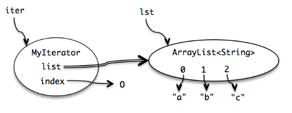

# 1. Java中的数据类型与变量
## 基本类型与引用类型
**根类**：所有引用类型均为**Object**的子类。
**包装类型**：基本类型不可变的容器。

| int     | long | byte | short | char      | float | double | boolean |
| ------- | ---- | ---- | ----- | --------- | ----- | ------ | ------- |
| Integer | Long | Byte | Short | Character | Float | Double | Boolean |

| 基本类型                                                 | 引用类型                                            |
| ---------------------------------------------------- | ----------------------------------------------- |
| int, long, byte, short, char, float, double, boolean | classes, interfaces, arrays, enums, annotations |
| 基本类型的包装类均为不可变 (immutable) 类                          | 一些是可变 (mutable) 类，一些是不可变类                       |
| 在方法中声明的储存在栈中，其余在堆中                                   | 均在堆中，由垃圾回收器回收                                   |
| 开销小                                                  | 开销大                                             |

# 2.类型检查
当一个数据类型赋值非法（即这个值不在数据类型的取值范围中）时，代码必然出现错误。
根据类型判断代码错误与否，就是类型检查。


•编程语言可以提供如下三种类型的检查：
	–静态检查：在编译时就发现错误。检查出来的错误叫静态错误。
	–动态检查：在运行时才发现错误。检查出来的错误叫动态错误。
	–无检查：根本不会发现错误，靠人工进行检查。
•注意：动态检查和动态类型语言没有必然的联系。即便是动态类型的语言也有这三种检查
•从尽早发现错误以节约时间的角度看：静态检查>动态检查>无检查。
•从发现错误种类的范围大小的角度看：动态检查>静态检查>无检查。
## 检查时机
- **静态检查**：在程序运行之前进行类型检查。对于静态类型语言（如 Java），所有变量的类型在编译时均已知，因此编译器可以在编译时检查类型。关于“数据类型”的检查，不考虑值。
- **动态检查**：在程序运行过程中进行类型检查，对于动态类型语言（如 Python），变量的类型在代码编写中不一定可知。关于“值”的检查。
- **无检查**：不进行类型检查，依靠程序员的自觉。可能导致程序错误。

## 基本数据类型检查陷阱
•① 整数除法：5/2 并不返回一个小数，而是一个去掉小数的整数。（期望该错误是一个动态检查能发现的错误，但无论是静态还是动态检查均不做检查）
•② 整数溢出：如果计算结果过大或负数过小而无法适应有限范围，则会返回错误答案。 （没有静态/动态检查！）
•③ 浮点类型中的特殊值。例如double中有一些不是数的特殊值：NaN，POSITIVE_INFINITY 和 NEGATIVE_INFINITY，拿这些值继续做运算，可能得到意想不到的结果。
•④ 强制类型转换：强行将类型范围大的变量、数据赋值给类型范围小的变量；
	这是我们期望它会是一个检查能发现的错误，实际上静态/动态检查均不报错，不检查。

### 类型转换
除具有祖先关系的类之外，一般两个类型间无法直接转换。
```java
String five = 5;         // ERROR
```

数字类型支持由下至上（由低精度到高精度）自动转换，而由上至下（由高精度到低精度）只能手动转换。
```java
int a = 2;               // a = 2
double a = 2;            // a = 2.0
int a = 18.7;            // ERROR
int a = (int)18.7;       // a = 18
double a = 2/3;          // a = 0.0
double a = (double)2/3;  // a = 0.6666...
```

# 3. 类型与引用的不变性 
**可变 (mutable)**：类的实例中的引用或基本类型变量值可以被改变。（不安全）
风险：
	传递可变值
	返回可变值
**不可变 (immutable)**：类的实例中的引用或基本类型变量值不可被改变，使用**final**实现。（安全）
注意 final 仅禁止该引用/该基本类型变量的值被改变，而并不禁止该引用所指向对象的内部的改变。
	–final 类：意味着这个类无法再被继承
	–final 方法：意味着这个方法无法再被重写（超类中定义）
	–final 变量：意味着这个变量的引用是不可变的
•编译器进行静态检查时，如判断 final 变量首次赋值后发生了改变，会提示错误（静态错误）
•使用不可变类型，对其频繁修改会产生大量的临时拷贝 ( 需要垃圾回收 )

•引用的不变性是指：变量一旦被确定指向某个内存空间中的对象，就不能再改变自己的指向。而对象的数值是否发生变化，则不在引用不变性的讨论范围中。
•不变对象是指该对象一旦被创建，就无法改变。如果原先指向这个对象的变量希望改变数值，它需要指向另一个不同的对象。例如，String 类型声明的对象就是一种不变对象。
#### 防御式拷贝 (defensively copy)
动机：可变类型对象的引用在被传递中（尤其是 get 方法）可能暴露给其它对象，从而被意外地改变，影响程序正确性。
方法：当对象需要暴露给外界时，使用其构造方法等手段将其拷贝，确保外界无法获取该对象及其内部各对象的引用。

# 4.Snapshot diagram
**描述**：一个程序在运行时某一时刻的内部状态，包括栈和堆。
##### 画法
•表示范畴：可变对象用单椭圆，不可变对象用双椭圆。
•表示对象类型：在圈中标注对象类型（注意不是变量名，变量名在外面呢！）
•表示变量（可选）：在圈中记录内部变量名，变量又有向外的引用
•表示变量类型：在圈中的变量名前标注变量类型
•表示内部的索引：在圈中用索引的数字表示
- **基本类型的值**：一个箭头指向该变量的值。
  
- **对象类型的值**：一个箭头指向一个椭圆，椭圆内部包含类名。对象内部的属性（field）用箭头指向它们的值。属性可以带类型，也可以不带。
  
- **可变值**：当变量值变化时，在原来的箭头（值）上打叉并画新的箭头（值）。
- **不可变对象**：用双圈表示
  
- **不可变(final)的引用**：使用双线箭头表示。
  

**题型**：给定代码，画出执行之后的 snapshot diagram。
##### 例题及解答
1
```java
public class Main {
    public static void main(String[] args) {
        ArrayList<String> lst = new ArrayList<String>();
        lst.add("a");
        lst.add("b");
        lst.add("c");
        MyIterator iter = new MyIterator(lst);
        // 画出运行至此行时，iter的snapshot diagram
    }
}

class MyIterator {
    private final ArrayList<String> list;
    private int index;
    public MyIterator(ArrayList<String> list) {
        this.list = list;
        this.index = 0;
    }
    public boolean hasNext() {
        return index < list.size();
    }
    public String next() {
        final String element = list.get(index);
        ++index;
        return element;
    }
}
```
2

3

4

#### 空引用 (null)
Java 中，对于对象的引用变量（例如类的实例变量、数组实例变量等）可被赋值为 null，但基本类型不能被赋值为 null。注意区分数组实例变量为 null 与数组实例变量不为 null 但数组中包含 null 的情形。
例如
```java
String names = new String[] {null}; // names=[null]
names = null;                       // names=null
```

# 5. 复杂数据类型：数组和集合
## 数组 Array
数组是 类型T 的 **固定长度** 序列。
•数组类型的操作包括：
–索引：`a [2]`
–赋值：`a [2] = 0`
–长度：`a.length`

## 列表 List
列表是 类型T 的**可变长度**序列
•部分操作：
–indexing：`list.get（2）`
–赋值：`list.set（2，0）`
–长度：`list.size（）`
•Note 1：列表是一个接口，由实现类实例化
•Note 2：列表中的成员必须是一个对象。
•Note3：Please use List rather than arrays

## 集合 Set
•集合是零个或多个唯一对象的无序集合。
•一个对象不能多次出现在一个集中。
Set 是一个抽象接口，其实现类包括 HashSet、LinkedHashSet、TreeSet 等

## Map
•Map 集合属于双列集合，该集合中的信息是 key-value 形式；而之前的 List 和 Set 都是单列集合。
Map集合中的每个元素，都包含了一个键(key)和一个值(value)，称其为键值对。Key 和value 可以是任何引用类型的数据，键 key 是无序、无下标、不重复的

操作：
`map.put(key, val)             // add the mapping key → val
`map.get(key)             // get the value for a key`
`map.containsKey(key)   // test whether the map has a key`
`map.remove(key)             // delete a mapping`

##  List, Set, and Map 的变量实现
•List, Set, and Map 都是接口：即，定义了类型的功能，但不提供具体的实现代码
•优点：用户可以根据情况选择合适的实现。
•List , Set , Map 的实现类
	–List: ArrayList and LinkedList
	–Set: HashSet
	–Map: HashMap
```Java
List<String> firstNames = new ArrayList<String>();
List<String> lastNames = new LinkedList<String>();

List<String> firstNames = new ArrayList<>();
List<String> lastNames = new LinkedList<>();

Set<Integer> numbers = new HashSet<>();

Map<String,Turtle> turtles = new HashMap<>();
```

## List, Set, Map 遍历 - 迭代器 Iterator
•迭代器 Iterator 是一个对象，它遍历一组元素并逐个返回元素，用来替换 for 循环，实现底层数据的隐藏。
•迭代器 Iterator 有两种方法：
	–`next（）`返回集合中的下一个元素
		（变异方法 mutator method 。会修改迭代器的方法，它不仅返回一个元素，还会修改内部状态，使得下一次使用它的时候返回下一个元素。）
	–`hasNext（）`测试迭代器是否已到达集合的末尾。


•为什么存在迭代器？
	–有多种具有不同内部表示形式的集合数据结构（链表、映射、哈希表），这些结构的访问形式各异
	–迭代器概念允许使用单一统一的方式来访问所有这些集合，以便客户端代码更简单，并且可以更改集合实现，而无需更改对其进行迭代的客户端代码，这是一个有效的设计模式。

# 6. 有用的不可变类型  
## 6.1 可变数据类型的不可变包装
## 6.2  不可修改集合的静态方法
## 6 .3 其他的不可变类型
•The primitive types and primitive wrappers are all immutable  
所有基本数据类型和对应的封装类
•String(字符串)，Enum(枚举)，LocalDate、LocalTime、LocalDateTime(时间)
•BigInteger、BigDecimal等
