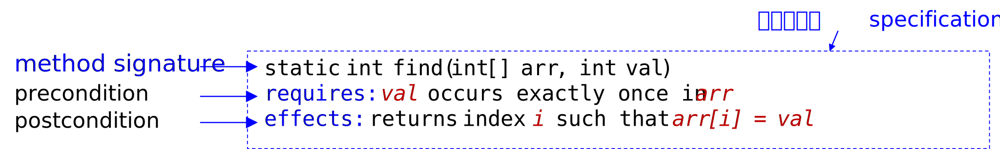
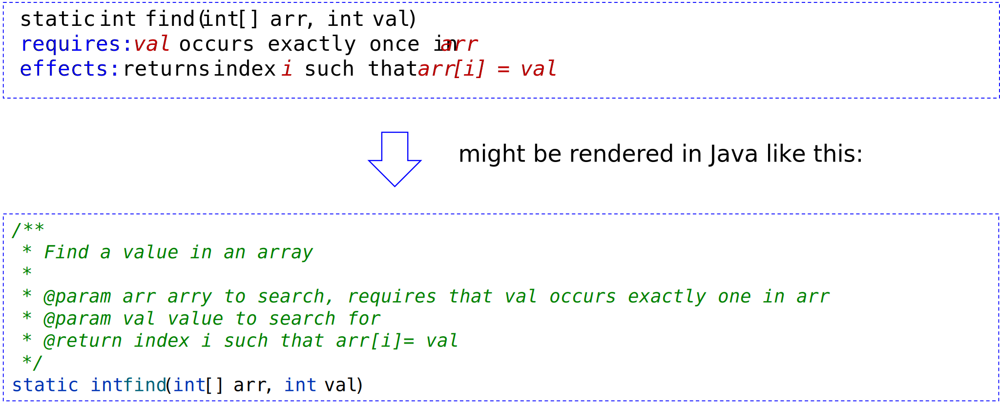
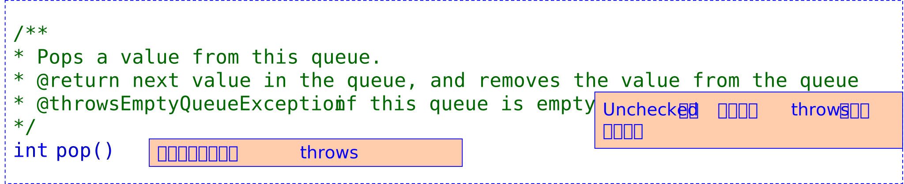

# 意义
为了让客户端接受可以相互替换的两种实现，我们需要一个规范（或称为契约，合同，合约）来明确说明客户端所依赖的内容。
客户端不需要知道实现
实现者不需要知道如何被使用
规约描述了方法的行为，即当前置条件被满足时，在方法完成后，后置条件一定被满足；当前置条件不被满足时，后置条件**可以**不被满足，或称方法的行为是任意的。
# 结构

**前置条件 (precondition)**：输入满足的条件，在注释中记作**requires**。
**后置条件 (postcondition)**：输出满足的条件，在注释中记作**effects**。
**例外行为 (exceptional behavior)**：当前置条件不满足时会发生的事件。

方法规约可以论述方法的参数和返回值，但不应该讨论方法的局部变量或方法类的私有字段。
# Java 中的规约
参数被`@param`注解描述，结果被`@return`和`@throw`子句描述
把前置条件写得 `@param` 中，在 `@retrun` 和 `@throws` 注解中写后置条件


## [Exceptions in Java](10.面向正确性与健壮性的软件构造.md#异常处理机制的角度)
将派生于 Error 或者 RuntimeException 的异常称为 unchecked 异常，所有其他的异常成为 checked 异常

对受检异常，需要在Javadoc 的@throws 注解以及方法签名名都声明。
```Java
/**
* Compute the integer square root.
* @param x value to take square root of
* @return square root of x
* @throws NotPerfectSquareException if x is not a perfect square
*/
int integerSquareRoot(int x) throws NotPerfectSquareException
```
对未检查异常 unchecked exception，Java 允许但不要求使用 throws子句，因此建议不写@throws 以避免误解该异常为受检异常。若非要写，也只在 Javadoc 中的 @throws 注解写，不要在方法签名上写。

# 设计
## 规约的强度
① 规约的强度
② 规约的确定性(描述的输出是否确定)
③ 规约的陈述性(只是描述了输出，还是描述了如何计算输出)
spec变强：更**放松的前置**条件 + 更**严格的后置**条件
越强的规约，意味着 implementer 的自由度和责任越重，而 client 的责任越轻。

称规约$S_2$比规约$S_1$**等价或更强**当且仅当以下条件同时成立
- $S_2$ 的前置条件相等或弱于 $S_1$ 的前置条件。
- $S_2$ 的后置条件相等或强于 $S_1$ 的后置条件。
满足强规约的实现一定满足弱规约。进而，**一个满足弱规约的方法一定可以安全地被替换为满足强规约的方法**。
注意**规约间可能无法比较强弱**。

## 规约的确定性
Deterministic 确定的规约：给定一个满足 precondition 的输入，其输出是唯一的、明确的
Under-deterministic 欠定的规约：同一个输入可以有多个输出
Nondeterministic 非确定的规约：同一个输入，多次执行时得到的输出可能不同

## 规约的类型
操作式规约：
	给出了方法实现的步骤，例如：伪代码。
	不建议使用，如有必要可以写在方法体的注释中
声明式规约：
	没有内部实现的描述，只有“初-终”状态。
	声明式规约更有价值，通常更短，更容易理解，最重要的是，不会暴露客户端可能依赖的实现细节

## 设计原则
•一个好的“方法”设计，并不是你的代码写的多么好，而是你对该方法的 spec 设计的如何。
	–client 用着舒服 
	–开发者编着舒服


### 内聚 be coherent
Spec 描述的功能应单一、简单、易理解
### 结果清晰
The results of a call should be informative
### 足够强 be strong enough
规范应该为客户提供足够有力的保证——它需要满足他们的基本要求。
### 有时需要足够弱 also be weak enough
太强的spec，在很多特殊情况下难以达到，给开发者增加了实现的难度
### 在规约中使用抽象类型 should use abstract types
在规约里使用抽象类型，可以给方法的实现体与客户端更大的自由度
### 前置条件和后置条件的平衡 Precondition or postcondition?
#### 注意事项
异常处理和测试策略、并发程序的线程安全性也需要写在 spec 中。