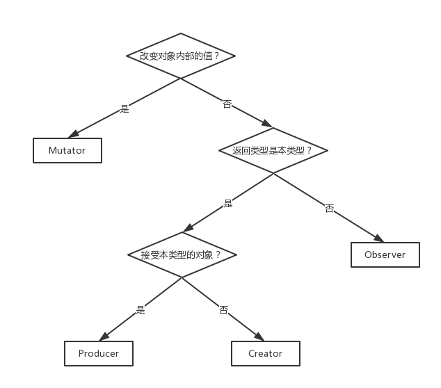
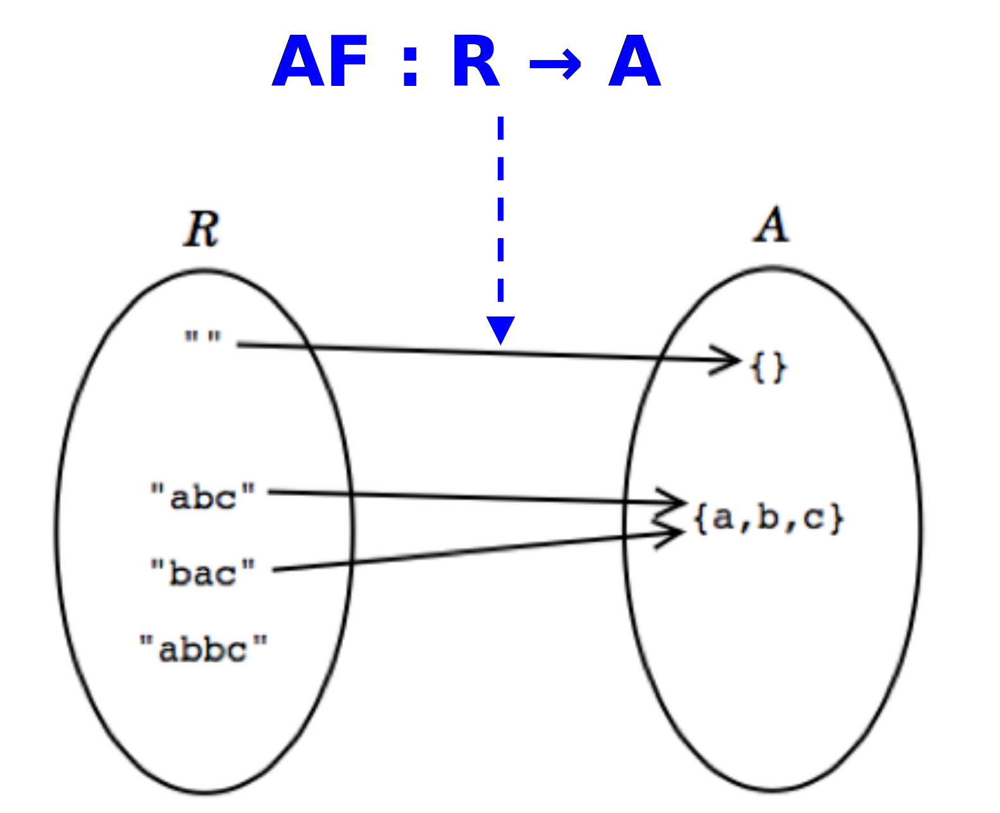

# 定义
•抽象数据类型 ADT 的形式定义可用三元组表示：
`（D,S,P）`
其中，D 是数据对象，S 是 D上的关系集，P 是对 D 的基本操作集。

数据结构是抽象数据型中的数学模型，抽象数据类型是数据结构加上一组操作

•ADT 特点：关注操作。使用者只要知道这些操作的用途就可以编程序了；至于这些操作是怎样实现的，以及内存中是如何表示的，并不影响使用者所编程序的编码形式。
ADT是由操作定义的，与其内部如何实现无关

# 操作的类型
- **Creators 构造器**：接受若干对象以构造新对象，但不包括接受本类型的对象从而构建新对象。参见**Producers**。
	- 从无到有
- **Producers 生产器**：接受一个或几个本类型的对象从而创建新对象。例如 String 中 concat () 方法。
	- 从有到新
- **Observers 观察器**：接受本类型对象，返回其他类型对象。例如 List 的 size () 方法、Set 的 contains () 方法。
- **Mutators 变值器**：改变对象内部值。例如 List 的 add () 方法。仅可变 (mutable) 类具有 mutators。
**注意事项**：上述描述中“接受”所指包括调用者。即若使用a.b (c) 的形式调用了方法 b（其中 a 为类的实例对象），视为 b 接受了 a 和 c 两对象。
区别：
```
–Creator :          t* → T
–Producer :     T+, t* → T
–Observer :     T+, t* → t
–Mutators :     T+, t* → void | t | T
```
说明
	– T 表示抽象数据类型自身
	– t 表示其他的数据类型
	– + 表示签名中出现 1..N次
	– * 表示签名中出现  0..N 次
	– | 表示 or

## ADT 的测试
•通过为每个操作创建测试来构建抽象数据类型的测试套件，这些测试不可避免地会相互影响。

•测试 creators, producers, and mutators：调用 observers 来观察这些操作的结果是否满足 spec；
•测试 observers：调用 creators, producers, and mutators 等方法产生或改变对象，来看结果是否正确。
•风险：如果被依赖的其他方法有错误，可能导致被测试方法的测试结果失效。

### **题型**：给定方法能够分类。
解题策略


# 设计原则
设计ADT：规格Spec–>表示Rep–>实现Impl
## 设计少量、简单的操作
设计少量、简单的操作，通过这些简单操作的组合实现复杂的操作。
每个操作应该有明确的目的，操作代表的行为应该是内聚的。
## 设计的操作应该完整
要足以支持 client 对数据所做的所有操作需要
	•操作的完整性的判断方法：对象每个 需要被访问到的属性 是否都能够被访问到
获取基本信息不应过于困难
## 要么抽象，要么具体，不要混合
•要么针对抽象设计，要么针对具体应用的设计

## 题型
给定需求，设计 ADT（包括 representation (rep)、abstraction function (AF)、representation invariants (RI)）
Rep：ADT 中的真实数据结构。
AF：所存储的数据对应于用户想要的何种内容。即从计算机中的数据到其现实含义的映射。
RI：确定存储的数据是否合法。通过 RI 可设计 checkRep ()。RI 的本质是从计算机中的数据到布尔值的映射。

# 相关概念

## 表示独立性 (Representation Independence)
> 对 ADT 中的字段进行限制

**定义**：称一个 ADT 是表示独立的，意为这个 ADT 的使用与它的表示（真实数据结构等）无关。表示内部的修改对 ADT 外部的代码没有影响。不具有表示独立性称为**表示泄露的 (representation exposed)**。
**意义**：具有表示独立性的 ADT，其使用及正确性仅与其各方法的 spec 有关，因此可以方便地修改 ADT 的内部表示以获得更佳的或更适用于新环境的性能。
**获得表示独立性的途径**：最简单的方式为将所有字段的访问控制全部设为 private，并对 producer 和 observer 加入防御性拷贝。

•Client 使用 ADT 时无需考虑其内部如何实现，ADT 内部表示的变化不影响外部规约和客户端
	–这意味着抽象类型的使用与其表示形式（也就是用于实现它的实际数据结构或数据字段）无关，因此表示形式的变化对抽象类型本身之外的代码没有影响。
	–例如 List 中的方法 是使用 链表 还是 数组 表示 无关。
•通过前提条件和后置条件充分刻画了 ADT 的操作 operations，spec 规定了 client 和 implementer 之间的契约，明确了client 知道可以依赖哪些内容，implementer 知道可以安全更改的内容。


## 不变量 Invariant
•不变量：程序在任何时候总是 true 的性质/特性。
	即：每个ADT 都有自己的一些特殊的性质，这些性质在程序的整个运行过程中，总是不变的。
	如：不可变性、变量类型、变量间的关系

一个设计良好的 ADT 的重要特性：ADT 需要始终保持它的**不变量**
•当 ADT 保留自己的不变量时，推理代码变得容易得多。
•总是要假设 client 有“恶意”破坏 ADT 不变量的行为---defensive programming
	（例如防御性的参数拷贝）

•“ADT 保持其自身的不变量”，也就意味着，ADT 负责确保其自身的不变量成立，与 client 端的任何行为无关。
如何做到：
	通过隐藏或保护不变量中涉及的变量（例如，使用 private 将某个类中的属性隐藏）
	并且，仅允许通过具有明确定义契约（规约）的操作/方法/函数 来访问，实现“ADT 保持其自身的不变量”这一性质。

## 表示泄露 Rep Exp
•意味着类的外部可以直接修改表示。
表示泄露不仅影响不变量（没有维持住不变的特性），也影响了表示独立性（无法在不影响客户端的情况下改变其内部表示）

•避免表示泄露
–不要将 **可变参数** 引入到对象中；制作防御副本
–返回 **可变字段** 的防御副本，而不是可变字段本身
–或返回 **可变字段** 的不可修改视图，例如**可变类型的不可变包装** Immutable wrappers
–返回**新实例**而不是修改原有的实例
–真正推荐的——使用**不可变的类型**，以消除防御性拷贝的需要

## 抽象函数 Abstract Function
抽象函数：表示空间R和抽象空间A之间映射关系的函数，即如何将 R 中的每一个值解释为 A 中的每一个值。
- 抽象值构成的空间（抽象空间）：客户端看到和使用的值
- 程序内部用来表示抽象值的空间（表示空间）：程序内部的值

AF的特性可以是：满射、非单射、未必双射

### Rep Invariant 表示不变量
•表示不变量 将 rep值 映射到 布尔值
`RI : R → boolean`
对于表示值 `r`，当且仅当 `r` 由 `AF` 映射时， `RI(r)` 才为真。
–表示不变性 RI：某个具体的“表示”是否是“合法的”
–也可将 RI 看作：所有表示值的一个子集，包含了所有合法的表示值

# 代码中的AF, RI, and safety from rep exposure
•在代码中用注释形式记录AF 、 RI 和表示泄漏的安全声明
–要精确的记录RI：rep中的所有fields何为有效
–要精确记录AF：如何解释每一个R值
–给出理由，证明代码并未对外泄露其内部表示——自证清白

