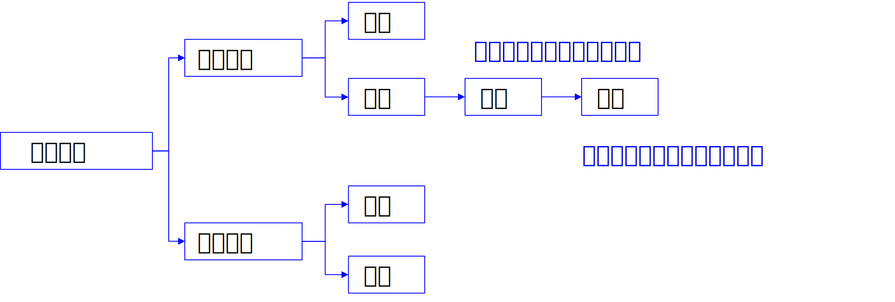
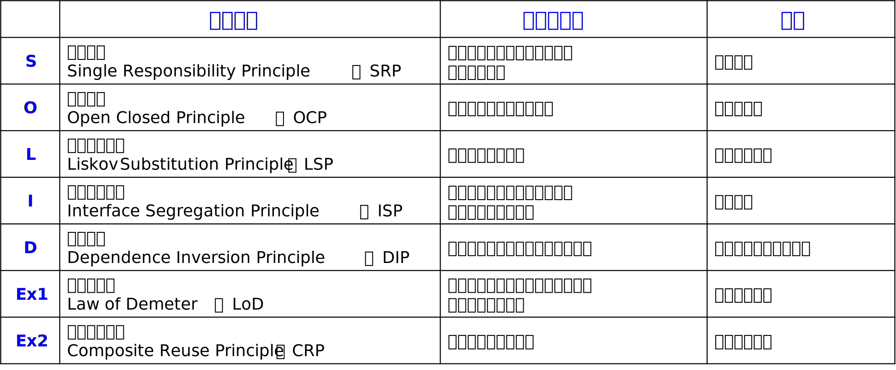
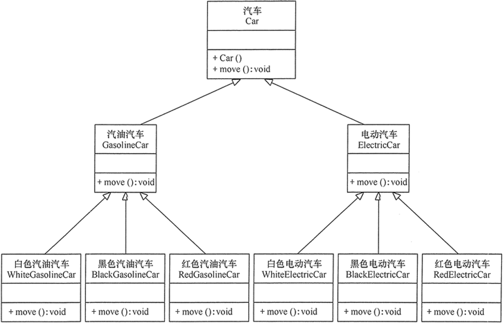

# 类间关系

## 泛化
类与类之间/接口与接口之间的一种继承关系，表示一般与特殊的关系，指定了子类如何特化父类的所有特征和行为
-6.png)
## 实现
也是一种继承关系，表示类是接口所有特征和行为的实现
-9.png)
## 依赖
两个相对独立的对象，当一个对象负责构造另一个对象的实例，或者依赖另一个对象的服务时
•在设计类时，尽量避免双向依赖
–可以将依赖关系理解为一种使用的关系，即“Use-a”的关系。
–再简单一点理解，类 A 使用到了类 B，并且这种使用关系具有偶然性，临时性，是非常弱的关系，但是 B 类中的变化会影响到类 A。
-11.png)
## 关联
对于两个相对独立的对象，当一个对象与另一个对象存在固定的对应关系时，这两个对象之间为关联关系。
关联关系是两个类一种强的依赖关系，与依赖关系中的偶然性不同，关联关系是长期性的。可以理解为一种拥有或者对应关系，称作为“Has-a”的关系
### 单向关联
类 A 当中使用了类 B，其中类 B 是作为类 A 的成员变量。
使用带普通箭头的实心线表示，指向被拥有者
-2.png)
### 双向关联
类 A 当中使用了类 B 作为成员变量，同时类 B 中也使用了类 A 作为成员变量。
可以使用有两个箭头或者没有箭头实心线表示
-3.png)
### 自关联
自己包含自己
-5.png)
## 聚合
•聚合关系属于关联关系的一种，耦合度强于关联，它们的代码表现是相同的，仅仅是在语义上有所区别。
•关联关系的对象间是相互独立的；而聚合关系的对象之间存在着包容关系，聚合关系强调是“整体”包含“部分”，但是“部分”可以脱离“整体”而单独存在。
-12.png)
## 组合
•组合关系是比聚合关系还要强的关系，它要求普通的聚合关系中代表整体的对象负责代表部分的对象的生命周期，
–即“整体”负责“部分”的生命周期，他们之间是共生共死的，并且“部分”单独存在时没有任何意义
-13.png)

## 面向对象的三大特点
所谓面向对象，即：
- 任何系统都是由能够完成一组相关任务的对象构成。
- 如果对象依赖于一个不属于它负责的任务，那么就需要访问负责此任务的另一个对象（调用其他对象的方法）。
- 一个对象不能直接操作另一个对象内部的数据，它也不能使其它对象直接访问自己的数据。
- 所有的「交流」都是通过「方法」的调用完成。
### 封装
- 隐藏对象的属性和实现细节，仅对外公式访问方法。
- 增加安全性和简化编程。
### 继承
- 子类继承父类的特征和行为。
- 实现代码的复用。
### 多态
- 同一个行为具有不同表现性态的能力（「一个接口，多个方法」）。
- 提高了程序的扩展性和可维护性。

## 面向对象的七个原则


可维护
可扩展
在设计面向对象的程序时，或者说，安排程序中的类和对象时，我们需要遵循七个原则。
### 单一职责原则 Single Responsibility Principle, SRP
就一个类而言，应该仅有一个能引起它变化的原因。
- 不同变化 $\Rightarrow$ 不相干的职责 $\Rightarrow$ 难以复用。
- 如果一个类有多于一个的职责，考虑职责的分离。
### 开闭原则 Open-Closed Principle, OCP
一个软件实体应「对扩展开放，对修改关闭」。对于一个模块而言，它应当可以在不被修改的情况下被扩展。
- 通过抽象类和接口，规定了具体类的特征，实现「对修改关闭」。
- 利用重载改变具体类，可以改变系统的行为，实现「对扩展开放」。
策略1：复用实现
策略2：复用抽象接口

例如，有下面的这些「电脑」类：
```java
class Computer { ... } // 父类，所有「电脑」都在这之下
class MacBook extends Computer { ... }   // MacBook 电脑的子类
class ThinkPad extends Computer { ... }  // ThinkPad 电脑的子类
class Surface extends Computer { ... }   // Surface 电脑的子类
```
如果想要引入一款新的电脑，不需要动上述任何代码（所谓的「闭」），只要增加（所谓的「开」）
```java
class MateBook extends Computer { ... }  // 华为 MateBook 电脑的子类
```
就行了。
### 里氏代换原则 Liskov Substitution Principle, LSP
使用父类的地方一定可以换成子类，反之不然。
```java
Computer a = new ThinkPad();  // 没问题
ThinkPad b = new ThinkPad();  // 没问题
ThinkPad c = new Computer();  // 大问题
```
#### Java编译器对LSP的保证
- 子类可以添加，但不可删除父类的方法。
- 具体类必须实现所有未定义的方法。
- 重写方法的返回类型必须为原方法返回类型或原方法返回类型的子类。
- 重写方法必须接受相同的参数类型。
- 重写方法不能抛出更多的异常，或原方法所抛异常的父异常。
#### LSP的其他要求（编译器无法检查）
- 子类比父类的不变式应当相等或更强。
- 子类的每个方法的后置条件应当比父类的对应方法的后置条件相等或更强。
- 子类的每个方法的前置条件应当比父类的对应方法的前置条件相等或更弱。
### 接口隔离原则 Interface Segregation Principle, ISP
客户端不应该依赖它不需要的接口。换句话说，使用多个专门的接口比使用单一的总接口要好。一旦一个接口太大，则需要将它分割成一些更细小的接口。

例如，定义下面的接口「人类的日常生活」
```java
interface PersonsDailyLife {
		public void sing();   // 唱
		public void move();   // 跳
		public void think();  // 思考
		public void mate();   // 谈恋爱
		...
}
```
然后让 `Person` 类去实现它。这样造成的问题是，智能手机也能 `sing` 和 `think`，但不能 `move` 和 `mate`。那么，当我们为「智能手机」编写相关的类时，就得重新做一个接口「智能手机的日常生活」。解决方案是将这个大接口拆分：
```java
interface Singable {
		public void sing();
}

interface Moveable {
		public void move();
}

interface Thinkable { ... }
interface Mateable { ... }
```
因为 Java 中一个类可以实现多个接口，所以
```java
class Person implements Singable, Moveable, Thinkable, Mateable { ... }
class Phone implements Singable, Thinkable { ... }
```
至此接口实现隔离。
### 依赖倒转原则 Dependency Inversion Principle, DIP
–高级模块不应依赖于低级模块，两者都应该依赖于抽象
–抽象不应该依赖于细节。细节应该取决于抽象。
–针对接口编程，不要针对实现编程
–又称控制反转( IoC，Inversion of Control)、依赖注入
-14.png)

接上面电脑的例子，若定义用户的「用电脑」函数为
```java
class User {
		public void useComputer(ThinkPad computer) {
				// 用电脑
		}
}
```
则这个用户就和 ThinkPad 这一款电脑「绑定」了，后续更换就变得麻烦。这就是「高层模块依赖低层模块」。正确的写法是
```java
class User {
		public void useComputer(Computer computer) {
				// 用电脑
		}
}
```
这样无论用户用什么牌子的电脑，都不用修改原有的代码。
### 合成复用原则 Composite Reuse Principle, CRP
尽量使用对象组合，而不是继承来到复用的目的。
即：在一个新的对象里面 **使用**（聚合关系）一些已有的对象，使之成为新对象的一部分。
例如：汽车 `Car` 按动力划分可以分为油车、电车，按颜色划分可以分成黑车、白车、红车等。如果用继承的方法实现它们，组合种类会非常多：

反过来，如果将「发动机」 `Engine` 、「颜色 」 `Color` 作为 `Car` 的内部字段，则能大大地降低代码的复杂度。这就是合成复用。

### 迪米特法则 Least Knowledge Principle，LKP
一个软件实体应当尽可能少的与其他实体发生相互作用。每一个软件单位对其他的单位都只有最少的知识，而且局限于那些与本单位密切相关的软件单位。


