## 设计模式
是一套被反复使用、经过分类编目的代码设计经验的总结。
根据「组件的生命周期」来分，可以分为「创建型模式」「结构型模式」和「行为型模式」三种；
根据「模式应用于类还是对象」，可以分为「类模式」和「对象模式」两种。
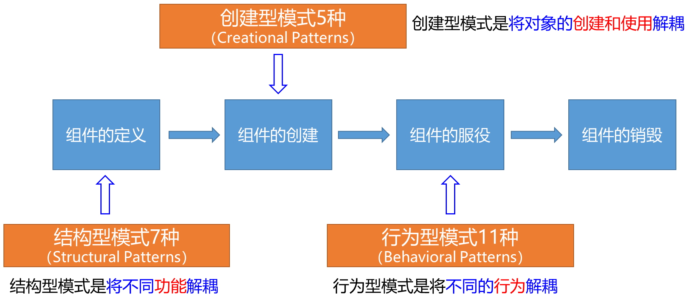
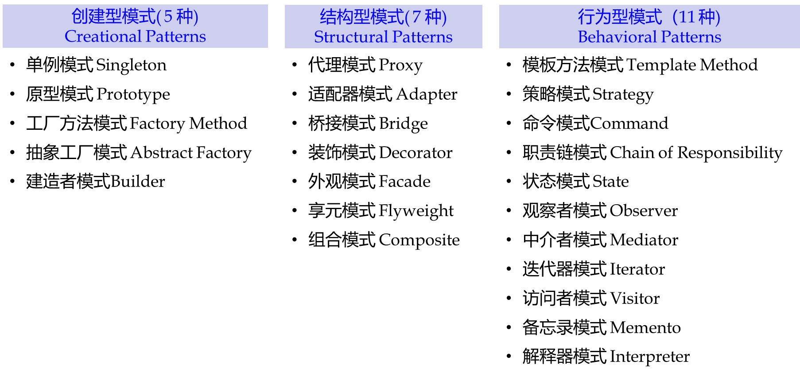
# 创建型模式
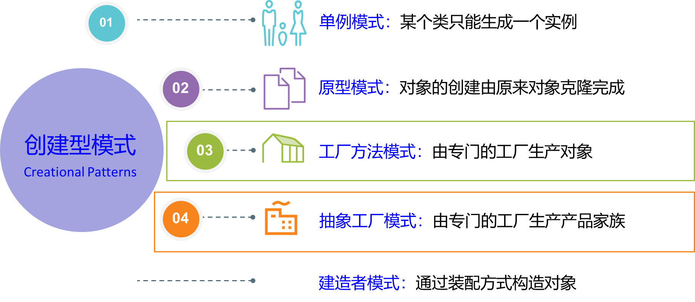
## 简单工厂（不属于 23 种之一）
包含三种角色：抽象产品、具体工厂，具体产品。
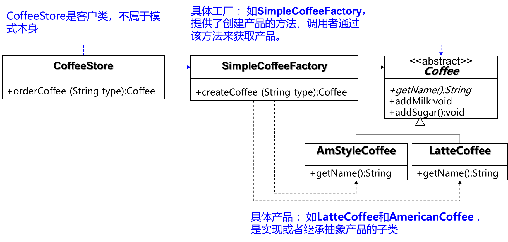
•在SimpleCoffeeFactory 中封装了工厂方法，使得客户端CoffeeStore和具体产品解耦，这种模式称为 “简单工厂方法模式”

•优点：
	–选择创建对象的逻辑被放在了工厂类里面
	–客户类 Client 不用自己创建对象
	–责任分离 (Responsibility separation)

•缺点：
	–在产品类层次结构中添加新的子类需要修改工厂类的源代码，即，需要在工厂方法里面的代码再增加一个条件语句，因此**违背了“开闭原则”**。

–简单工厂方法模式的中心是具体的工厂类.
–简单工厂的工厂方法是一般是静态的。

### 用配置文件解耦简单工厂方法模式
可以通过简单工厂模式+配置文件的方式解除 工厂对象 和 产品对象 的耦合。在工厂类中加载配置文件中的全类名，并创建对象进行存储，客户端如果需要对象，直接进行获取即可。

## 工厂方法模式
- 抽象工厂（抽象类） `Creator`：提供创建工厂的接口，指导「工厂」的结构。
    - 具体工厂 `ConcreteCreatorA`、`ConcreteCreatorB` ……：继承 `Creator` 并具体化「生产」不同产品的方法。
- 抽象产品（接口） `Product`：提供产品的功能接口，指导「产品」的结构。
    - 具体产品 `ConcreteProductA`、`ConcreteProductB` ……：实现 `Product` 并具体化不同的功能。
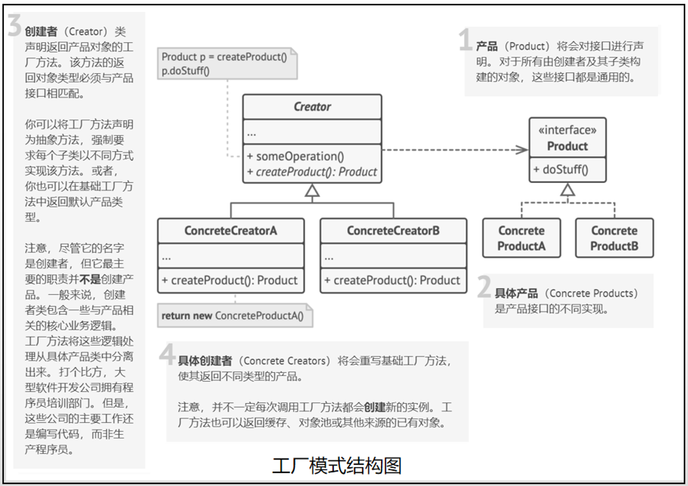
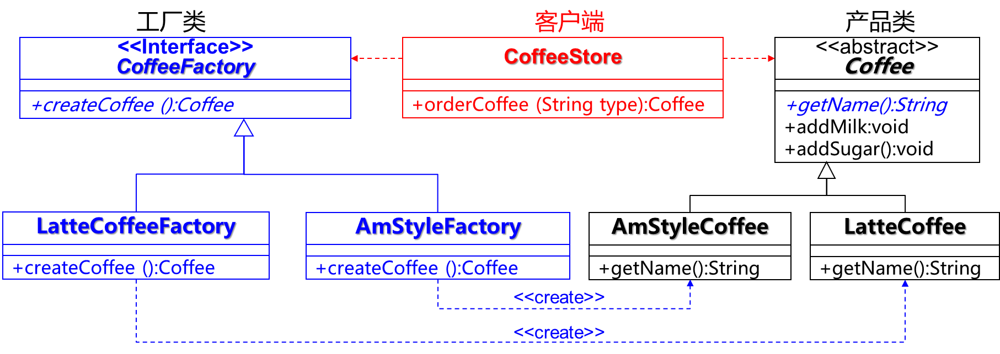
•优点：
	–用户只需要知道具体工厂的名称就可得到所要的产品，无须知道产品的具体创建过程；
	–在系统增加新的产品时只需要添加具体产品类和对应的具体工厂类，无须对原工厂进行任何修改，满足开闭原则；

•缺点：
	–每增加一个产品就要增加一个具体产品类和一个对应的具体工厂类，这增加了系统的复杂度。

–工厂方法模式的中心是抽象工厂超类 (或接口类)
–工厂模式中，工厂方法不是静态的，并且分布在各个具体的工厂子类里面

## 抽象工厂模式
是一种为访问类提供一个创建一组相关或相互依赖对象的接口，且访问类无须指定所要产品的具体类就能得到同族的不同等级的产品的模式结构。
抽象工厂模式是工厂方法模式的升级版本，工厂方法模式只生产一个等级的产品，而抽象工厂模式可生产多个等级的产品。
	–对于工厂方法模式，产品是单个产品类层次结构；
	–对于抽象工厂模式，产品是一组产品类层次结构。
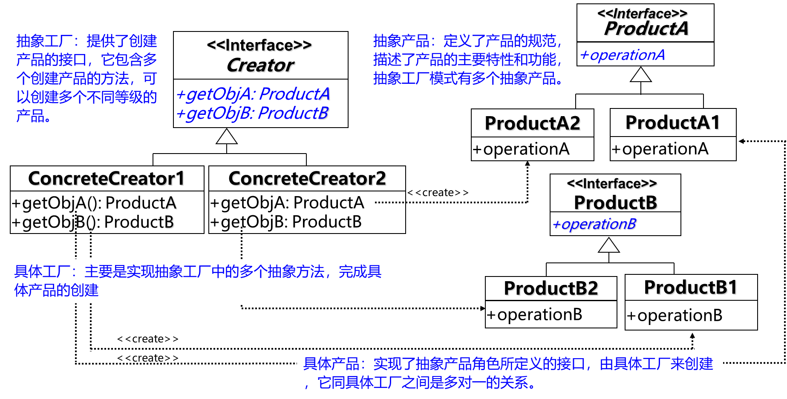

适用于有多个产品族的情景。围绕一个超级工厂创建其他工厂。该超级工厂又称为其他工厂的工厂。
添加「产品等级」（在下例中，为增加一个手机品牌，如「三星」）相当简单，只要让工厂实现 `ProductFactory` 接口，让自己的产品分别实现 `PhoneProduct` 和 `RouterProduct` 接口就可以。但要增加产品族（下例中，为增加一个新的产品类型，如「平板电脑」）十分困难。
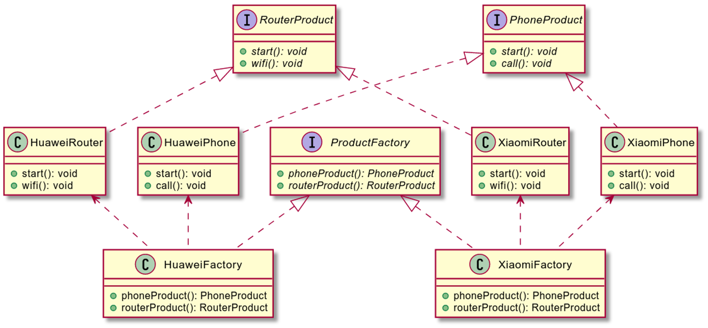

–抽象工厂模式仅部分遵循开闭原则。
	添加具体产品不影响已存在代码
	添加新的产品层次类不满足 OCP

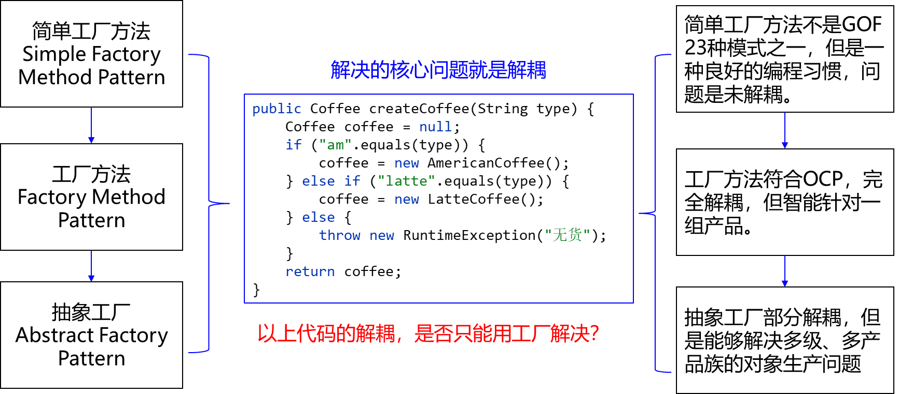

## 其他创建型模式 （了解）
### 单例模式 Singleton
使用静态变量，保证一个类仅有一个实例，并提供一个访问它的全局访问点。
单例模式能实现对唯一实例的受控访问，减少了资源的开销，并能全局访问，避免对共享资源的多重占用。
单例模式允许可变数目的实例。
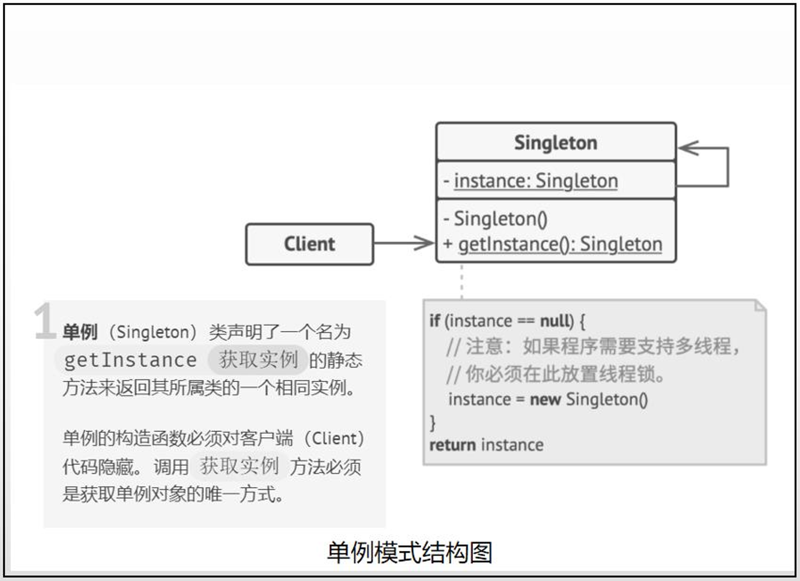

### 原型模式 Prototype
用一个已经创建的实例作为原型，通过复制该原型对象来创建一个和原型对象相同的新对象
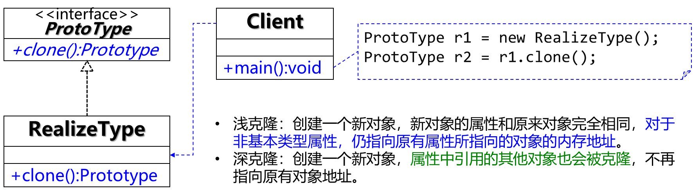

### 建造者模式 Builder
•建造者（Builder）将一个复杂对象的构建与表示分离。
•即：将一个复杂的对象分解为多个简单的对象，然后一步一步构建而成。它将变与不变相分离，即产品的组成部分是不变的，但每一部分是可以灵活选择的
将对象构建代码从其自身类中提取出来，并将其移动到称为建造者的单独对象中。
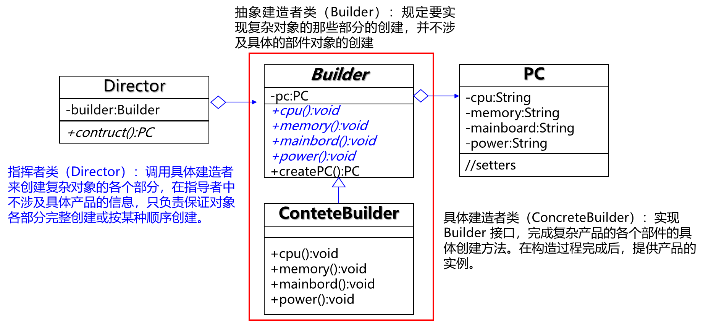
开发中也可以将 Builder 和 Director 合并

•工厂方法模式注重的是整体对象的创建方式；而建造者模式注重的是部件构建的过程，意在通过一步一步地精确构造创建出一个复杂的对象。
建造者模式就是一个产品的组装工厂，通过对部件的组装可以返回一个完整的产品

# 结构型模式
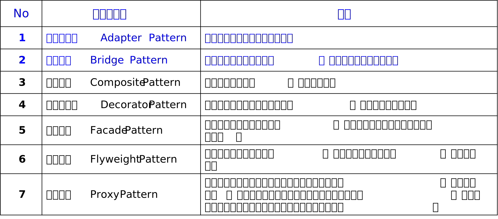

## 适配器模式 Adapter
### 类适配器
新增父类。并且在父类中提供所有方法的声明，以满足LSP
类适配器模式实现方式：定义一个适配器类来实现当前系统的业务接口，同时又继承现有组件库中已经存在的组件
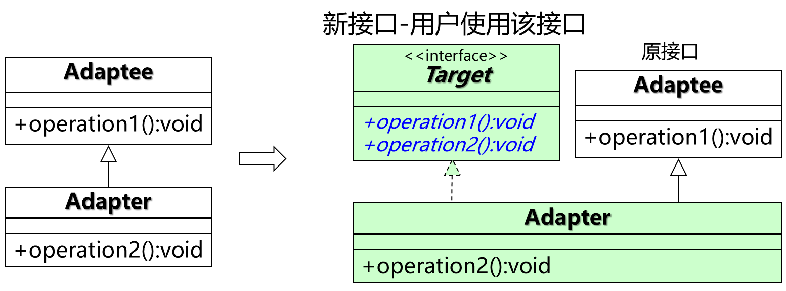
Adapter 类需要实现所有的 Target 接口中的方法。但 operation1() 是尽管没有显示，但根据继承的原理，该方法自动从 Adaptee 继承，因此只需要实现 operation2() 即可
### 对象适配器
换个父类。适配器类 Adapter 不再继承 Adaptee，而是实现新建的Target接口，并聚合原接口。
对象适配器模式实现方式：将现有组件库中已经实现的组件引入适配器类中，该类同时实现当前系统的业务接口。
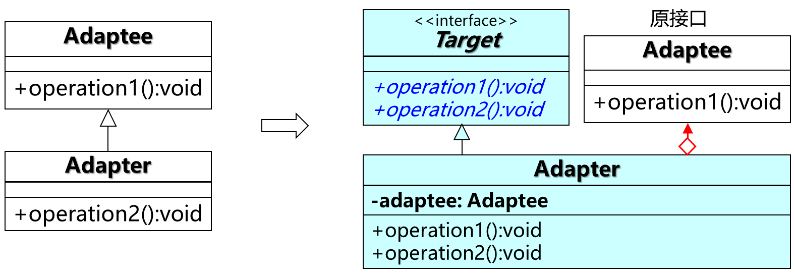
### 适配器模式的应用场景
#### 1 封装有缺陷的接口设计
为了隔离设计上的缺陷，我们希望对外部系统提供的接口进行二次封装，抽象出更好的接口设计，这个时候就可以使用适配器模式
#### 2 统一多个类的接口设计
#### 3 替换依赖的外部系统
把项目中依赖的一个外部系统替换为另一个外部系统的时候，利用适配器模式，可以减少对代码的改动
#### 4 适配不同格式的数据
适配器模式主要用于接口的适配，实际上，它还可以用在不同格式的数据之间的适配。

## 桥接模式 Bridge
将两个变化的维度分开设计，可以使各维度独立地，互不影响地增加类，并满足开闭原则
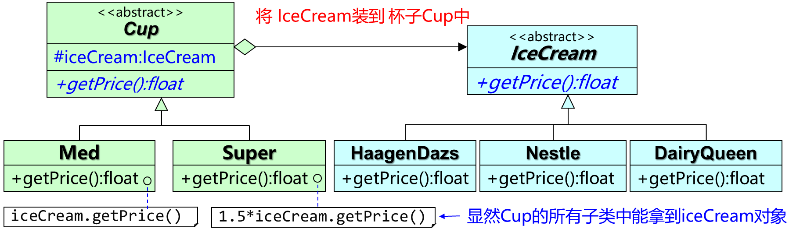
### 桥接模式的结构
•将抽象部分与其实现部分解耦，使它们可以独立地变化。
–桥接模式的核心思想是将一个系统分为多个维度，并通过桥（Bridge）连接这些维度，从而实现更灵活的系统设计。
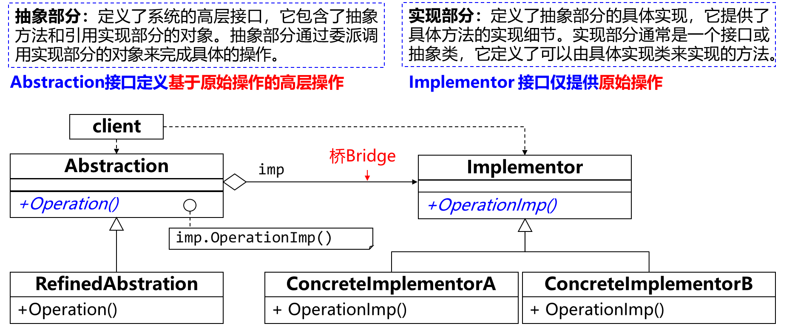
### 优点——满足 OCP
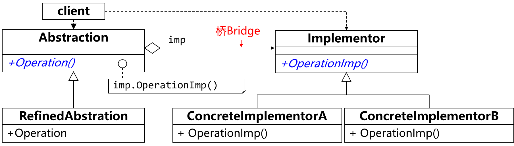
•解耦：将抽象部分和实现部分分离，使它们可以独立地变化。实现部分聚合到抽象部分，可以在运行时动态配置
•扩展性：容易添加新的抽象部分和实现部分，扩展系统的功能。
•可维护性：修改抽象部分或实现部分的代码不会对另一部分产生影响，易于维护。

## 其他结构型模式
来自深圳学长笔记
### 数据访问对象模式
用于将低级的数据操作从高级的业务逻辑中分离。
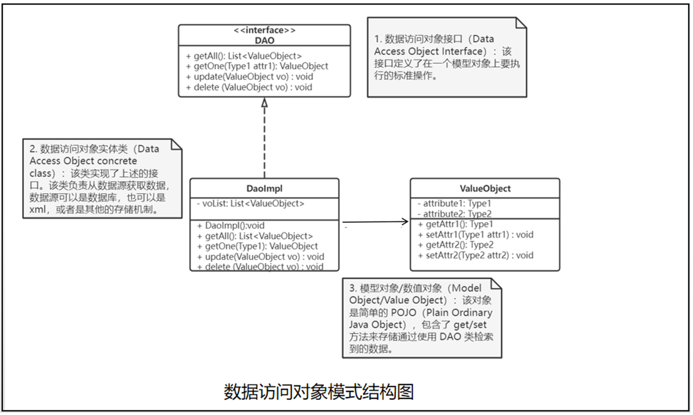
# 行为型模式
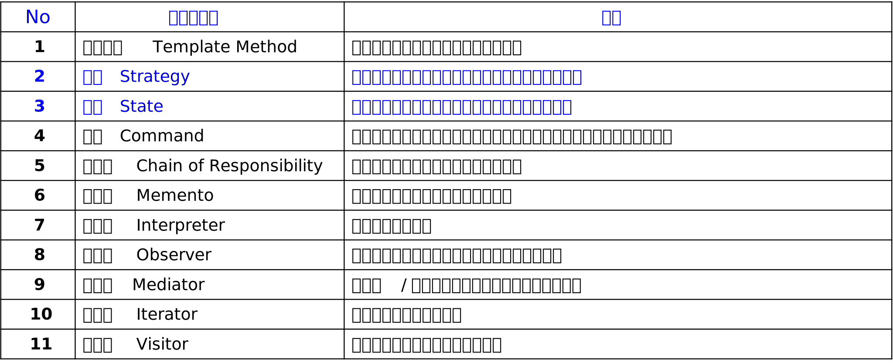
除了模板方法模式和解释器模式是**类**行为型模式，其他的全部属于**对象**行为型模式
## 策略模式 Strategy
•定义：
	该模式定义了一系列算法，并将每一个算法封装起来，使它们可以相互替换，且算法的变化不会影响使用算法的客户。
•说明：
	策略模式属于对象行为模式，它通过对算法进行封装，把使用算法的责任和算法的实现分割开来，并委派给不同的对象对这些算法进行管理。

策略模式将对象与算法分离，使得在有多种算法相似的情况下，避免多个 if-else 语句所带来的复杂和难以维护。

•使用场景：
	–一个系统需要动态地在几种算法中选择一种时，可将每个算法封装到策略类中。
	–一个类定义了多种行为，并且这些行为在这个类的操作中以多个条件语句的形式出现，可将每个条件分支移入它们各自的策略类中以代替这些条件语句。
	–系统中各算法彼此完全独立，且要求对客户端隐藏具体算法的实现细节时。
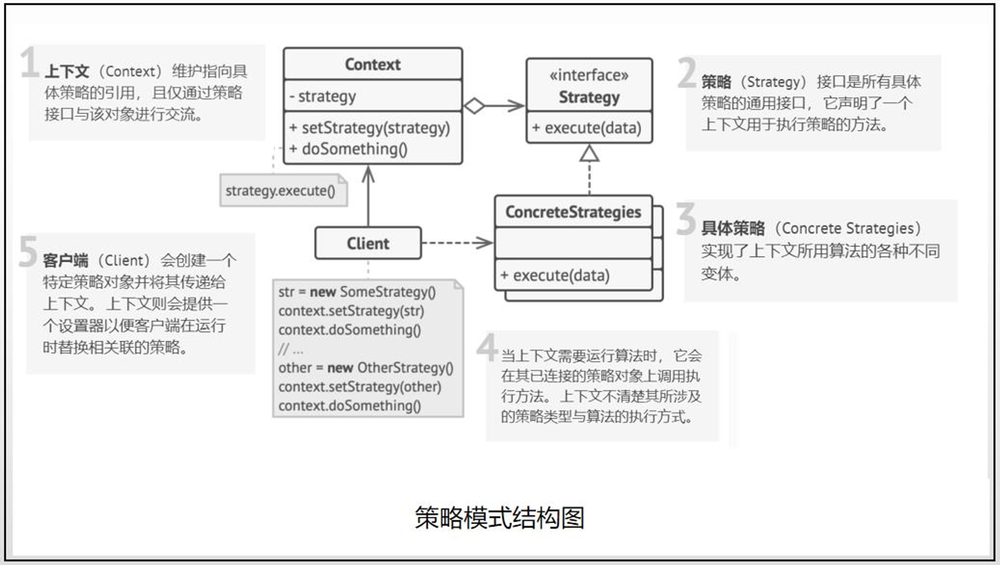
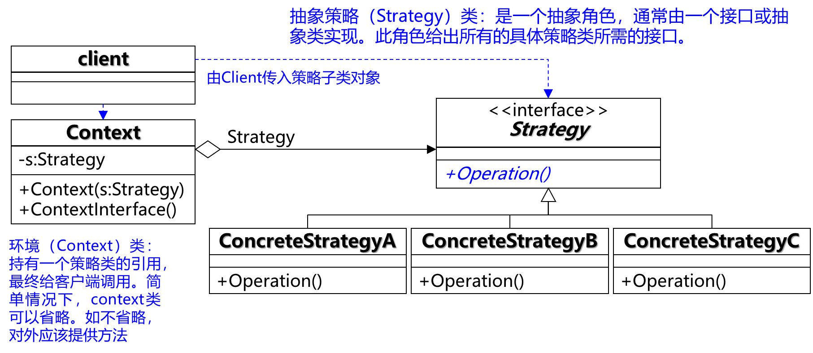
使用策略模式的优点：算法可以自由切换，扩展性好；
但增加暴露的策略类可能不易维护。

## 状态模式 State
•定义：
	–允许一个对象在其内部状态改变时改变它的行为。对象看起来似乎修改了它的类
	–对有状态的对象，把复杂的“判断逻辑”提取到不同的状态对象中，允许状态对象在其内部状态发生改变时改变其行为。
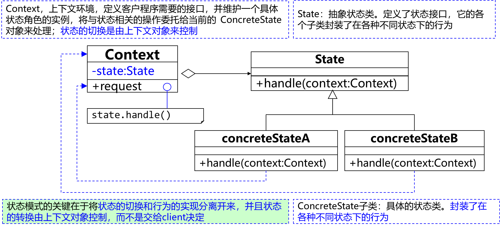
•优点
	–解决switch-case、if-else带来的难以维护的问题；
	–结构清晰，提高了扩展性，不难发现，Context类简洁清晰了，扩展时，几乎不用改变，而且每个状态子类也简洁清晰了，扩展时也只需要极少的改变。

•缺点
	–随着状态的扩展，状态类数量会增多
		几乎所有解决类似问题的设计模式都存在这个缺点；
	–增加了系统复杂度，使用不当将会导致逻辑的混乱，状态类增多，且涉及到状态的转移；
	–不完全满足开闭原则，因为扩展时，除了新增或删除对应的状态子类外，还需要修改涉及到的相应状态转移的其它状态类。

•应用场景
	一个操作中含有庞大的分支结构，并且这些分支决定于对象的状态时，就可以考虑使用状态模式

### 状态模式中状态对象重复创建问题
•状态模式虽然解决了很多问题，但是每次状态的切换都需要创建一个新的状态对象，而原本它仅仅是一个小小的枚举值而已，对象重复的创建资源开销过于巨大
•要解决对象重复创建的问题，单例模式(创建型)和享元模式(结构型)都是不错的选择，具体选用哪一个，就要看状态类的数量和个人的喜好。
	–状态类较多时，建议使用享元模式

### 状态模式的并发问题
•此时，由于状态是单例的，可以在多个上下文之间共享，而任何时候，涉及到全局共享就不得不考虑并发的问题。
–因此，除非明确需要共享，否则状态类中不应持有其它的资源，不然可能产生并发问题。
–同样的原因，状态类也不要通过属性的方式持有对 Context 的引用(可以依赖，但不要关联），这也是在红绿灯案例中采用局部变量对 Context 进行传参的原因。

### 状态模式&策略模式
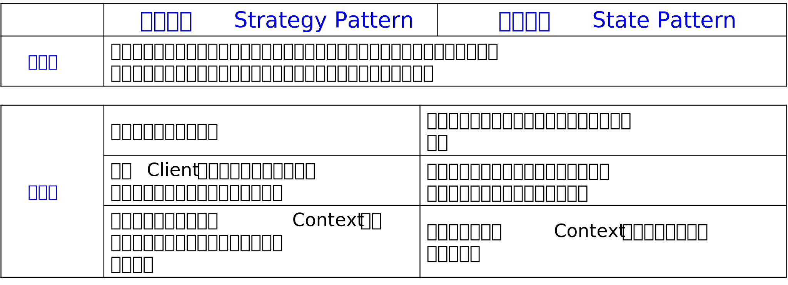
## 其他行为型模式
来自深圳学长笔记
### 迭代器模式
是对聚合类（例如 `List` 和 `Set`）的一种访问方式。使用 `iterator()` 方法可以从支持迭代器模式的聚合类中获得迭代器 `Iterator`。对迭代器有下面的常用方法：
- `next()` 获取下一个元素。
- `hasNext()` 检测集合中是否还有元素。
- `remove()` 移除当前返回的元素。
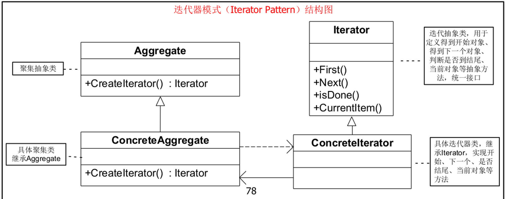
### 观察者模式
定义了对象之间一种一对多的依赖关系，让一个对象的改变能够影响其他对象。
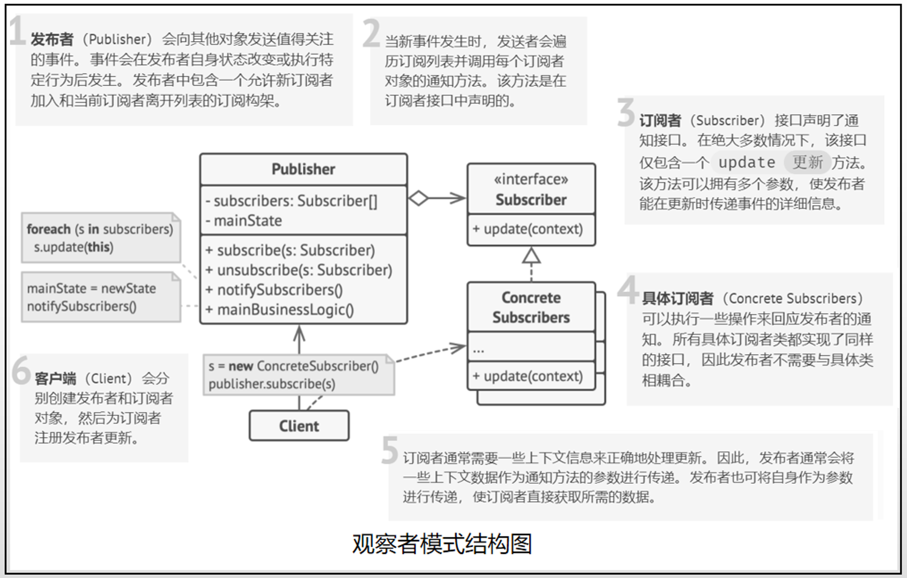
### 模板方法模式
定义一个操作中的算法骨架，将一些步骤延迟到子类中，使得子类可以不改变一个算法的具体结构即可重新定义该算法的特定步骤。
- 钩子操作（可以重新定义）
- 抽象操作（必须重新定义）
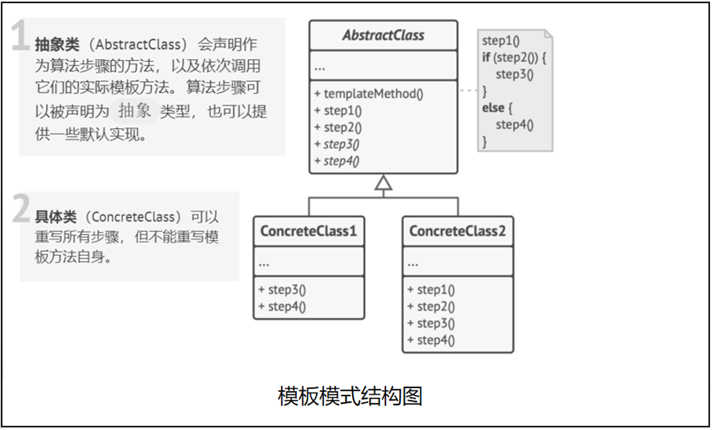
