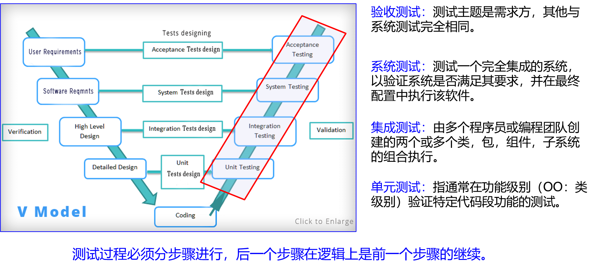
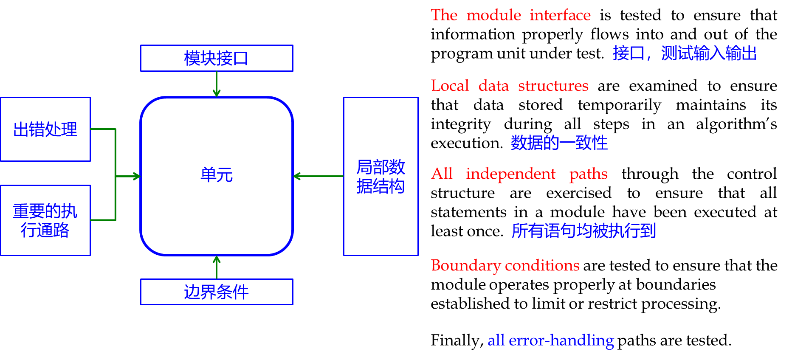
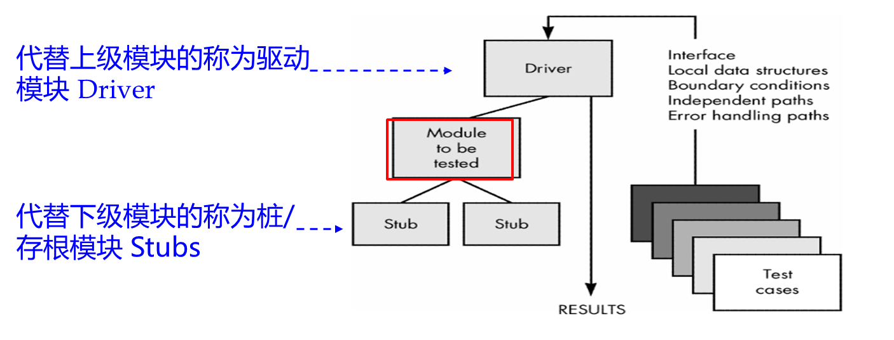
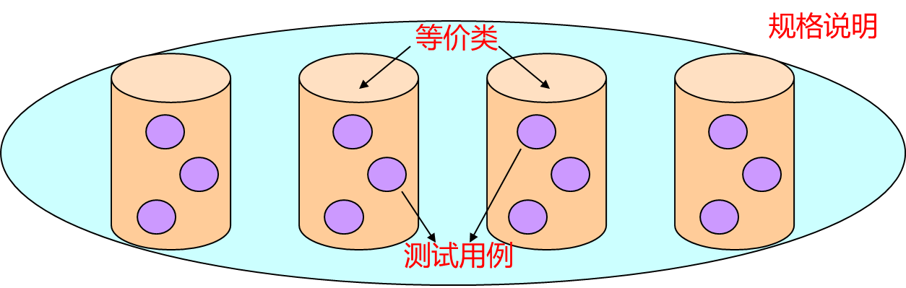
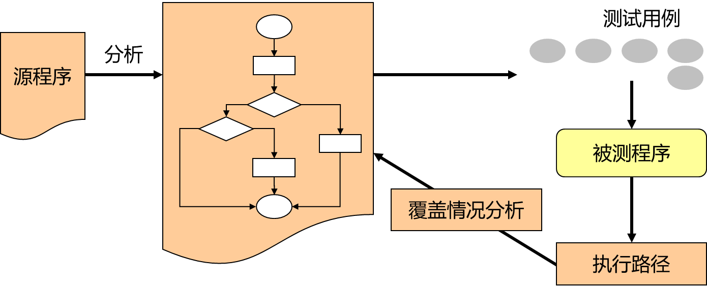
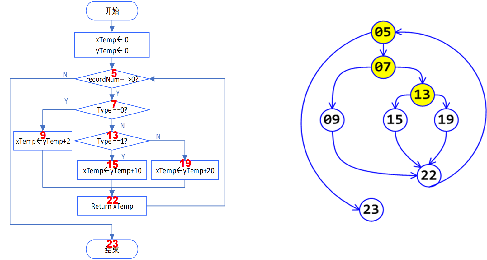
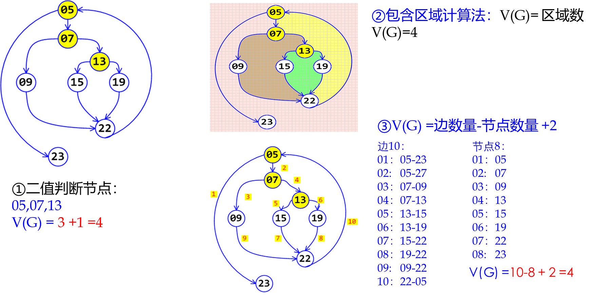
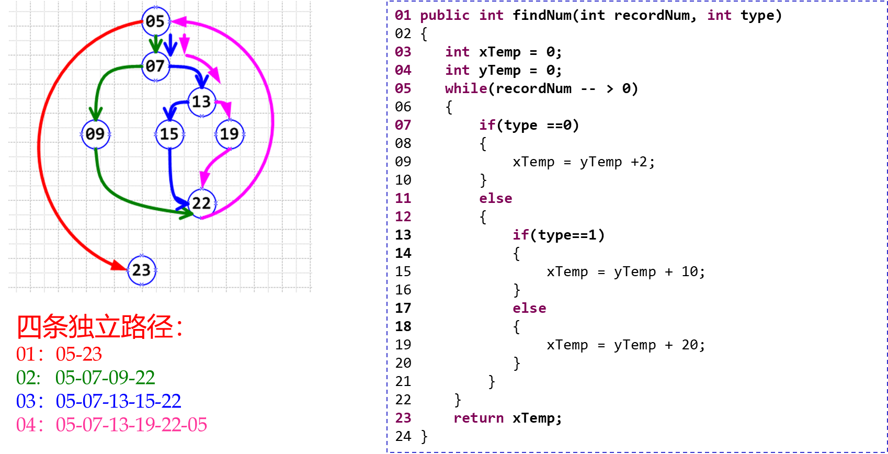

# 基本概念
## 为什么软件测试很难
穷举+暴力=不可能
靠偶然测试没意义
. 基于样本的统计数据对软件测试意义不大—软件与物理产品的巨大差异

## 残留缺陷率
•即使是最严格的测试，也无法达到 100% 的无错误
- **每千行代码1-10个缺陷**：这被认为是行业软件的典型情况。这意味着对于每千行代码，可能在开发和测试阶段没有被捕捉到的缺陷数量在一到十个之间。
- **每千行代码0.1-1个缺陷**：这是一个更高的标准，表明了高质量的验证。像某些Java库这样经过严格测试的软件可能会达到这个水平，这比行业平均水平要好得多。
- **每千行代码0.01-0.1个缺陷**：这代表了最高级别的验证质量，通常需要用于安全关键系统，这些系统中失败是不可接受的。像NASA或者专门从事高可靠性软件的公司Praxis可能会达到这个级别的缺陷率。
目标不一定是实现零缺陷，而是管理和减少存在的缺陷所带来的风险到一个可接受的水平。这通常是通过结合严格的测试、代码审查、静态分析和其他质量保证实践来完成的。
## 测试的时期

黑盒测试
	（又称功能测试）把程序看作一个黑盒子，完全不考虑程序的内部结构和处理过程。在程序接口进行的测试，测功能。
白盒测试
	（又称结构测试）是把程序看成装在一个透明的白盒子里，测试者完全知道程序的结构和处理算法。在程序内部的测试，测逻辑

## 测试的级别

# 单元测试
针对软件的最小单元模型开展测试，隔离各个模块，容易定位错误和调试
属于编码的一部分，可早于或者晚于编码

单元测试的总体流程：

单元测试的重点：

## 驱动模块与桩模块
•在多模块程序中，每一模块都可能调用其它模块或者被其它模块所调用。所以在单元测试时，需要为被测试模块编制若干测试软件，给它的上级模块或下级模块作替身。

## assertXXX in JUnit4
–`assertEquals()` 方法。用来查看对象中存的值是否是期待的值，与字符串比較中使用的equals()方法相似；
–`assertFalse()` 和 `assertTrue()`方法，用来查看变量是是否为 false或 true，假设 assertFalse()查看的变量的值是 false 则測试成功，假设是 true 则失败，assertTrue() 与之相反。
– `assertSame()` 和 `assertNotSame()` 方法。用来比較两个对象的引用是否相等和不相等，相似于通过“\==”和“!=”比較两个对象。
–`assertNull()` 和 `assertNotNull()` 方法，用来查看对象是否为空和不为空。

## 测试用例
测试用例={ 测试数据 + 期望结果 }
测试结果={ 测试数据 + 期望结果 + 实际结果}

测试策略（根据什么来选择测试用例）非常重要，需要在程序中显式记录下来

如何设计测试用例
利用白盒测试、黑盒测试进行设计根据单元测试的重点，对模块接口，局部数据结构，边界条件，重要通路，出错处理进行数据编制。

# 黑盒测试
•黑盒测试（又称功能测试）把程序看作一个黑盒子，完全不考虑程序内部结构和处理过程的情况下，对程序接口进行测试。

•黑盒测试常用的策略有：Equivalence Partitioning 等价类划分和 边界值分析Boundary Value Analysis 两种

## Equivalence Partitioning 等价类划分
•把输入数据的可能值划分为若干个等价类，使每类中的任何一个测试用例，都能代表同一等价类中的其它测试用例，从而降低测试用例数量

## Boundary Value Analysis 边界值分析
•思想：大量的错误发生在输入域的“边界”而非中央
如：
–0 is a boundary between positive numbers and negative numbers
–Maximum and minimum values of numeric types, like int and double
–Emptiness (the empty string, empty list, empty array) for collection types
–The first and last element of a collection

•边界值分析方法是对等价类划分方法的补充

# 白盒测试
黑盒测试完全从函数 spec 导出测试用例，不考虑函数内部实现
白盒测试是一种测试用例设计方法，盒子指的是被测试的软件，白盒指测试者清楚盒子内部的结构以及是如何运作的。

独立/基本路径测试：对程序所有执行路径进行等价类划分，找出有代表性的最简单的路径(例如循环只需执行1次)，设计测试用例使每一条基本路径被至少覆盖1次。

## 路径测试五步法
### Step1：绘制流图/程序图；

### Step2 ：计算程序图环复杂度V(G) ；

### Step3 ：确定独立路径
V(G)值即为独立路径的数量；
独立路径：至少引入程序的一个新处理语句集合，或一个新条件的路径，即独立路径至少包含一条在定义该路径之前不曾用过的边。

### Step4 ：设计执行每条独立路径的测试用例。
输入值是根据独立路径选取的；不同测试者选取的值可能不同。
### Step5 ：进行测试

## 代码覆盖率
代码覆盖率是用来描述特定测试运行时程序的源代码执行程度的度量。
白盒测试应考虑程序内部逻辑的测试用例的代码覆盖率。
代码覆盖度：已有的测试用例有多大程度覆盖了被测程序
	通常用百分比衡量覆盖度

代码覆盖度越低，测试越不充分
但要做到很高的代码覆盖度，需要更多的测试用例，测试代价高

### 几类代码覆盖率
函数覆盖 
	•Function coverage: has each function in program been called? 
语句覆盖 
	•Statement coverage: is every statement run by some test case? 
分支覆盖 
	•Branch coverage: for every if or while or switch-case or for statement in the program, are both the true and the false direction taken by some test case? 
条件覆盖 
	•Condition coverage: for every condition in if/while/for/switch-case statement, are both the true/false direction taken by some test case? 
路径覆盖 
	•Path coverage: is every possible combination of branches — every path through the program — taken by some test case? 

测试效果：路径覆盖>分支覆盖>语句覆盖
测试难度：路径覆盖>分支覆盖>语句覆盖
在不同的软件类型中、不同的公司中，对达到何种标准的覆盖度都有不同的要求

